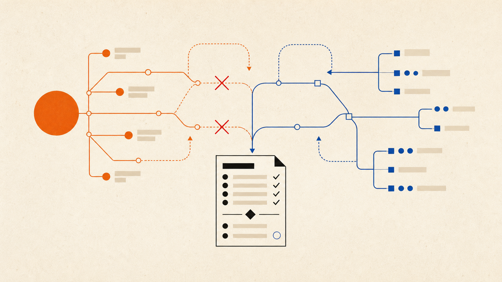

# Oppenheimor Agent Skills

Personal Agent skills, writing workflows, and reusable automation patterns.

这个仓库用于沉淀我长期使用的 Agent 工作流。每个 skill 都是一个可以独立安装、阅读和演进的工作单元，目标不是堆积提示词，而是把真实使用中反复验证过的判断、边界和交付流程保存下来。

## 快速安装

安装 `human-agent-meeting`：

```bash
npx skills add https://github.com/oppenheimor/oppenheimor-agent-skills --skill human-agent-meeting
```

安装其他单个 skill，只需替换 `--skill` 后的名称：

```bash
npx skills add https://github.com/oppenheimor/oppenheimor-agent-skills --skill personal-website-post-writer
npx skills add https://github.com/oppenheimor/oppenheimor-agent-skills --skill renhua
npx skills add https://github.com/oppenheimor/oppenheimor-agent-skills --skill herdr-radar
npx skills add https://github.com/oppenheimor/oppenheimor-agent-skills --skill x-video-downloader
```

`personal-website-post-writer` 会调用 `renhua` 完成中文去 AI 味编辑，使用时建议两者一起安装。

## Skills

| Skill | 用途 | 文档 |
| --- | --- | --- |
| `human-agent-meeting` | 把 Human 与 Agent 的讨论整理成可回放的 Markdown 决策纪要 | [README](./skills/human-agent-meeting/README.md) · [SKILL.md](./skills/human-agent-meeting/SKILL.md) |
| `herdr-radar` | 增量收集 Herdr 官方动态与社区玩法，生成保留原始链接和媒体的中文阅读报告 | [SKILL.md](./skills/herdr-radar/SKILL.md) |
| `personal-website-post-writer` | 把真实技术经历整理成 personal-website 中文文章并完成发布流程 | [SKILL.md](./skills/personal-website-post-writer/SKILL.md) |
| `renhua` | 清理中文 AI/技术写作中的模板腔和伪洞察表达 | [SKILL.md](./skills/renhua/SKILL.md) |
| `x-video-downloader` | 下载公开 X 帖子中的最高分辨率视频并保存到桌面 | [README](./skills/x-video-downloader/README.md) · [SKILL.md](./skills/x-video-downloader/SKILL.md) |

### `human-agent-meeting`



把一次 Agent 对话视为一场真正的会议。用户显式“散会”时，它会回看当前任务，把结论、争议和行动沉淀成可以长期检索的 Markdown 决策纪要。

```text
/human-agent-meeting
```

它会处理：

- 结论优先，同时保留 Human 质疑、Agent 修正和共识形成过程；
- 记录决策依据、约束、被否决方案、未决问题和明确行动项；
- 按项目和日期归档，同一场会议再次触发时重整并更新原纪要；
- 没有最终结论也可以归档，并标注 `unresolved` 或 `blocked`；
- 只使用本次讨论真实出现的证据，对凭证强制脱敏；
- 只接受用户显式触发，不自动制造会议纪要。

默认归档结构：

```text
<project-root>/docs/meetings/
└── YYYY-MM-DD/
    └── <topic>-会议纪要.md
```

完整的触发方式、会议状态、模板结构和安全边界见 [`human-agent-meeting/README.md`](./skills/human-agent-meeting/README.md)。

### `herdr-radar`

手动触发的 Herdr 增量情报雷达。它会读取上次进度，从 GitHub Releases、官方 Blog、官方与社区 X、插件市场和 GitHub 社区仓库收集新内容，去重过滤后生成中文 Markdown 阅读报告。

它只负责信息收集和简单分析，不会安装插件、修改 Herdr 配置、自行实验或创建定时任务。首次运行默认回看最近 14 天，后续按来源独立推进游标，并重叠回看 7 天避免漏抓。环境中存在 `web-access` Skill 时会优先使用；没有时回退到宿主提供的联网与浏览器能力。

执行规则、来源获取方式和报告格式见 [`herdr-radar/SKILL.md`](./skills/herdr-radar/SKILL.md)。

### `personal-website-post-writer`

把当前上下文、部署过程、排障记录、产品体验或 AI 工作流整理成 personal-website 里的中文文章。

它会处理：

- 参考 2026.07 之前的旧文章风格
- 判断文章类型
- 敏感信息脱敏
- 使用 `renhua` 去 AI 味
- 保存到 `src/pages/posts`
- 本地校验
- commit 和 push

执行规则见 [`personal-website-post-writer/SKILL.md`](./skills/personal-website-post-writer/SKILL.md)。

### `x-video-downloader`

传入单条 X（Twitter）帖子链接，自动提取页面公开暴露的 MP4 变体，选择每个视频的最高分辨率版本并保存到 `~/Desktop`。它只处理具体帖子，不批量抓取账号，也不绕过私密内容、付费墙或 DRM。

执行规则和命令行用法见 [`x-video-downloader/README.md`](./skills/x-video-downloader/README.md)。

### `renhua`

中文 AI/技术写作去 AI 味编辑器。

它主要用于清理这类问题：

- 二元对比壳
- 伪洞察标记
- 冒号讲义腔
- 空泛总结
- 顺滑但没有作者判断的表达

执行规则见 [`renhua/SKILL.md`](./skills/renhua/SKILL.md)。

## 仓库结构

```text
oppenheimor-agent-skills/
├── README.md
├── skills.json
├── skills/
│   ├── human-agent-meeting/
│   │   ├── README.md
│   │   ├── SKILL.md
│   │   ├── assets/
│   │   │   ├── human-agent-meeting-cover.png
│   │   │   └── meeting-notes-template.md
│   │   └── evals/
│   │       └── evals.json
│   ├── herdr-radar/
│   │   ├── SKILL.md
│   │   ├── agents/
│   │   │   └── openai.yaml
│   │   ├── references/
│   │   │   ├── report-format.md
│   │   │   └── sources.md
│   │   └── scripts/
│   │       └── radar_state.py
│   ├── personal-website-post-writer/
│   │   ├── SKILL.md
│   │   └── evals/
│   │       └── evals.json
│   ├── renhua/
│   │   ├── SKILL.md
│   │   └── agents/
│   │       └── openai.yaml
│   └── x-video-downloader/
│       ├── README.md
│       ├── SKILL.md
│       ├── evals/
│       │   └── evals.json
│       ├── scripts/
│       │   └── x_video_downloader.py
│       └── tests/
│           └── test_x_video_downloader.py
├── templates/
│   └── skill/
│       └── SKILL.md
└── docs/
    └── conventions.md
```

## 新增 skill 约定

每个 skill 使用独立目录：

```text
skills/<skill-name>/
├── SKILL.md
├── README.md      # 可选，面向使用者的说明
├── references/   # 可选
├── scripts/      # 可选
├── assets/       # 可选
└── evals/        # 可选
```

`SKILL.md` 必须包含 frontmatter：

```yaml
---
name: skill-name
description: 简明描述触发场景和能力边界
---
```

基本规则：

- 目录名与 frontmatter `name` 保持一致；
- `description` 同时说明触发场景、能力范围和默认产出；
- 稳定模板、图片和其他输出资源放入 `assets/`；
- 固定流程型 skill 尽量提供 `evals/evals.json`；
- 新增或修改 skill 后，同步更新根目录 `skills.json` 和本 README。

完整约定见 [`docs/conventions.md`](./docs/conventions.md)。
